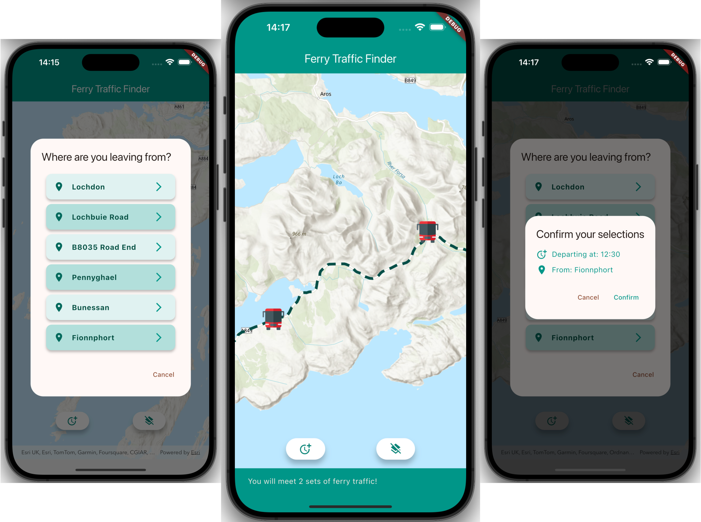

# ferry_traffic_helper

A cross platform mobile app for iOS and Android that shows the meeting point of two vehicles travelling toward each other at different speeds along the single track A849 road along the Ross of Mull. This app was built with the [ArcGIS Maps SDK for Flutter](https://developers.arcgis.com/flutter).

You can read more about this app and how it was built in the blog post [How to map vehicle meeting points using ArcGIS Maps SDK for Flutter
](https://www.esri.com/arcgis-blog/products/developers/developers/mapping-vehicle-meeting-flutter) on ArcGIS Blog.

## Running the app

The app can be run on an iOS or Android simulator or device. 

- Clone or download this repository
- Navigate to the `ferry_traffic_helper` directory and run `flutter pub upgrade` from the terminal to configure the dependencies.
- Install arcgis_maps_core from the terminal with `dart run arcgis_maps install`
- You will also need an API Key access token to run this app.
    - Follow the [Create an API Key tutorial](https://developers.arcgis.com/documentation/security-and-authentication/api-key-authentication/tutorials/create-an-api-key/) and copy your generated API Key.
    - Add the new API key directly to `main.dart` (not recommended for production use) or create an environment JSON file that can be loaded with `flutter run --dart-define-from-file=path/to/json/file.json`
    - The JSON file should be of format: `{ "API_KEY": "your_api_key_here"}`
- Ensure a simulator is running or a device is connected to your development machine
- Run or debug the app to launch it

## Getting Started

This project is a starting point for a Flutter application.

A few resources to get you started if this is your first Flutter project:

- [Lab: Write your first Flutter app](https://docs.flutter.dev/get-started/codelab)
- [Cookbook: Useful Flutter samples](https://docs.flutter.dev/cookbook)

For help getting started with Flutter development, view the
[online documentation](https://docs.flutter.dev/), which offers tutorials,
samples, guidance on mobile development, and a full API reference.
